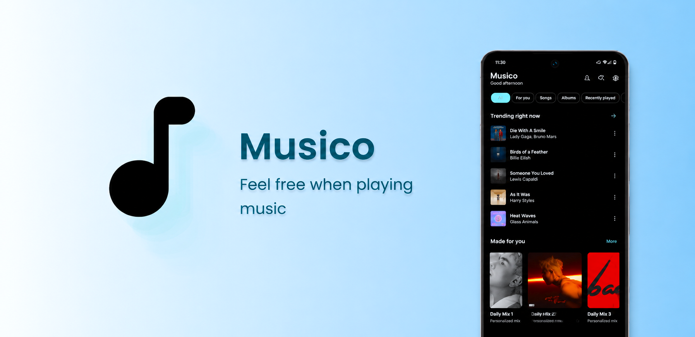

  

   
   

  # Musico
  **Feel free when playing music**

  

    A modern, high-performance, and open-source (FOSS) music client crafted for an effortless, ad-free listening experience with high-fidelity audio, synchronized lyrics, offline caching, and a clean interface.
  

  <!-- Badges -->
  

    
    
    
    
    
  

  <!-- Quick Action Buttons -->
  

    
    
    
  

---

## Overview

**Musico** is built around one clear philosophy: **music should feel effortless.**

No paywalls, no intrusive commercial advertisements, no tracking, and no complex menus. Open Musico, discover trending music or search for your favorite tracks, and enjoy crystal-clear audio quality directly on your device.

---

## Key Features

| Feature | Specification | Description |
| :--- | :--- | :--- |
| **Ad-Free Playback** | `Zero Interruption` | Uninterrupted listening experience without audio ads or pop-up banners. |
| **High-Fidelity Audio** | `Up to 320 kbps` | High-definition stream resolution prioritizing clear, lossless-level acoustics. |
| **Offline Downloads** | `Direct Caching` | Save songs and playlists locally to enjoy seamless offline playback anytime. |
| **Synchronized Lyrics** | `Real-Time Sync` | Live synchronized lyrics viewer that highlights lines as the track plays. |
| **Lightning Search** | `Instant Query` | Fast search across songs, artists, albums, and community playlists. |
| **Exact Track Playback** | `Direct Audio Match` | Plays the exact selected track without low-quality substitutions or remixes. |
| **Library Management** | `Local & Custom` | Organize your favorites, curate playlists, and view listening history easily. |
| **Adaptive Modern UI** | `Dark Surface` | Minimal aesthetic with fluid transitions and responsive layouts. |
| **Sleep Timer & Queue** | `Smart Controls` | Integrated sleep timer for nighttime playback and full queue reordering. |
| **Privacy-Centric FOSS** | `MIT License` | Open source with zero analytics, telemetry tracking, or mandatory logins. |

---

## Download & Installation

Get the latest stable build of **Musico** directly from official GitHub Releases.

### Android Installation
1. Navigate to the [Latest Releases](https://github.com/novosynk/Musico/releases/latest) page.
2. Download the `.apk` package (e.g., `Musico-vX.X.X.apk`).
3. Open the downloaded file on your device.
4. Confirm installation from your browser or file manager if prompted.
5. Launch **Musico** and start streaming.

---

## Interface & Experience

- **Mini Player**: Convenient continuous playback bar while navigating through catalogs and libraries.
- **Immersive Full Player**: Large cover artwork display, precision scrubber, lyrics view, and audio quality toggles.
- **Moods & Vibes**: Curated channels based on current atmosphere (Deep Focus, Chill, Night Drive, Workout, and more).
- **Focused Audio**: Designed strictly around music without clutter or unwanted recommendations.

---

## Privacy & Security

- **No Account Required**: Immediate access to listening without mandatory account registration.
- **Zero Telemetry**: Listening records, queries, and preferences stay on your local device.
- **Auditable & Open**: 100% open-source codebase under the MIT License.

---

## Author & Maintainers

### Lead Author
- **Mahmud Tonmoy** (হজবরল তনু)
  - GitHub: [@hozoboroloTonu](https://github.com/hozoboroloTonu)
  - Organization: [NovoSynk](https://github.com/novosynk)
  - Contact: `musico@novosynk.com`

### Project Team & Community
Developed and maintained with the support of the **NovoSynk** community.

---

## Contributing

Contributions, feedback, and bug reports are welcome:

1. Fork the repository (`git fork`).
2. Create your branch (`git checkout -b feature/NewFeature`).
3. Commit your changes (`git commit -m 'Add NewFeature'`).
4. Push to branch (`git push origin feature/NewFeature`).
5. Submit a **Pull Request**.

For bugs or feature requests, open an [Issue](https://github.com/novosynk/Musico/issues).

## License & Legal Information

This project is free and open-source software licensed under the **MIT License**.

### Summary of Rights & Terms

| Permissions | Conditions | Limitations |
| :--- | :--- | :--- |
| **Commercial Use** | License and copyright notice inclusion | **No Liability** |
| **Modification & Adaptation** | Retain original license file | **No Warranty** |
| **Distribution & Sublicensing** | Provide attribution to original authors | **No Trademark Endorsement** |
| **Private & Personal Use** | - | - |

See the full [LICENSE](LICENSE) file for complete terms and conditions.

### Third-Party Trademarks & Disclaimer
- **Musico** is an independent, community-driven open-source player built for personal media consumption and research.
- All product names, trademarks, audio streams, and registered trademarks (such as YouTube, Spotify, and related entities) are property of their respective owners.
- Musico is not affiliated with, officially connected to, or endorsed by any third-party media streaming services.

---

  Developed with passion by <b>Mahmud Tonmoy (hozoboroloTonu)</b> & the <b>NovoSynk</b> community.

